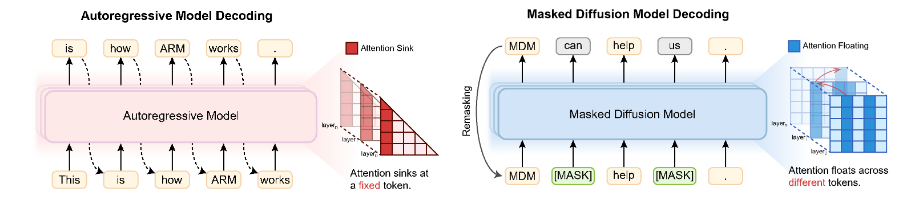
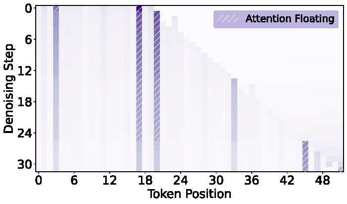
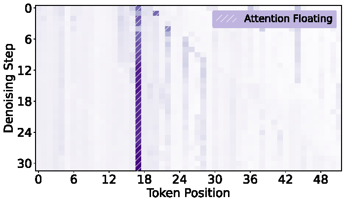
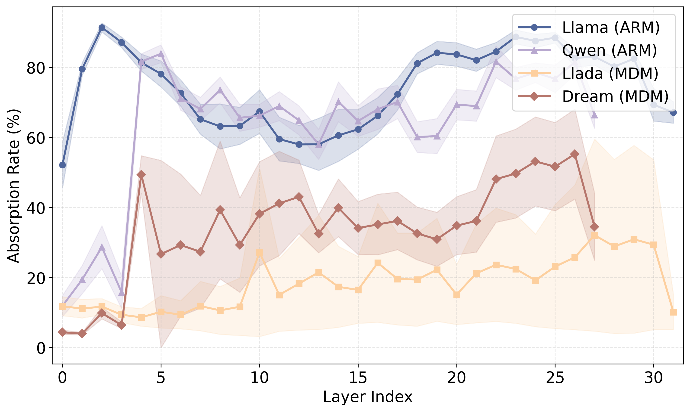
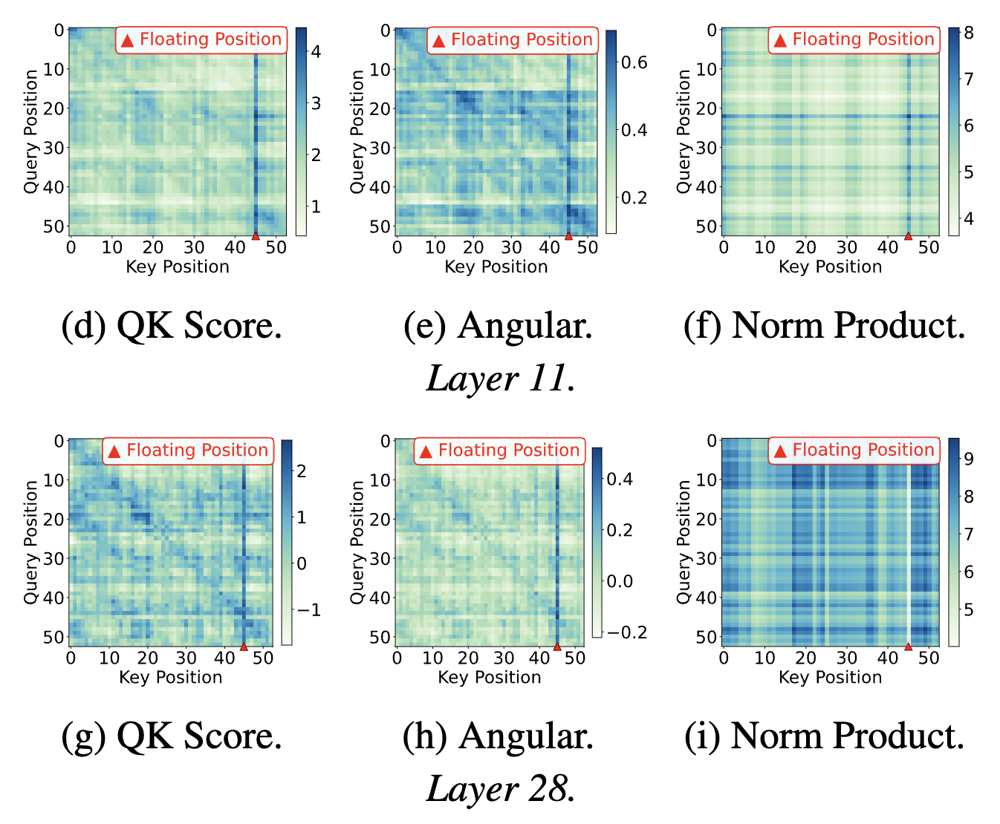
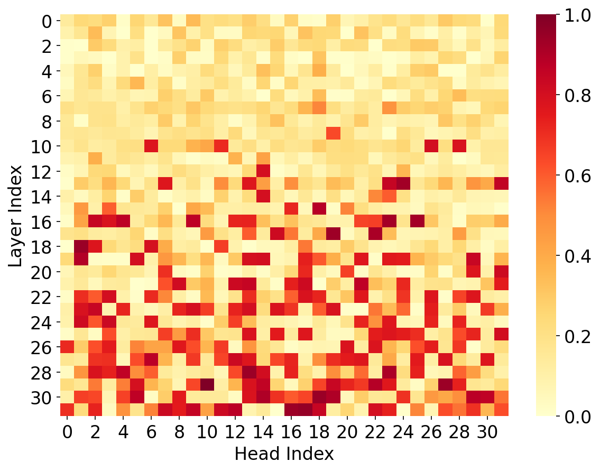
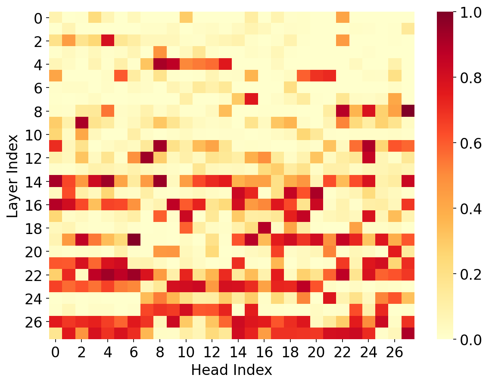
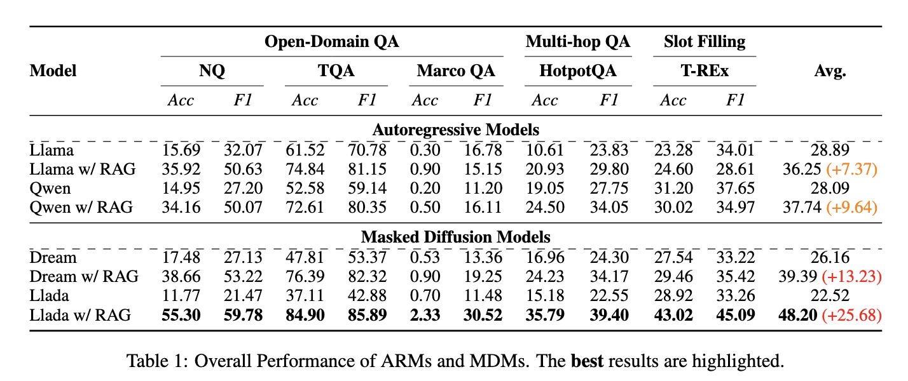
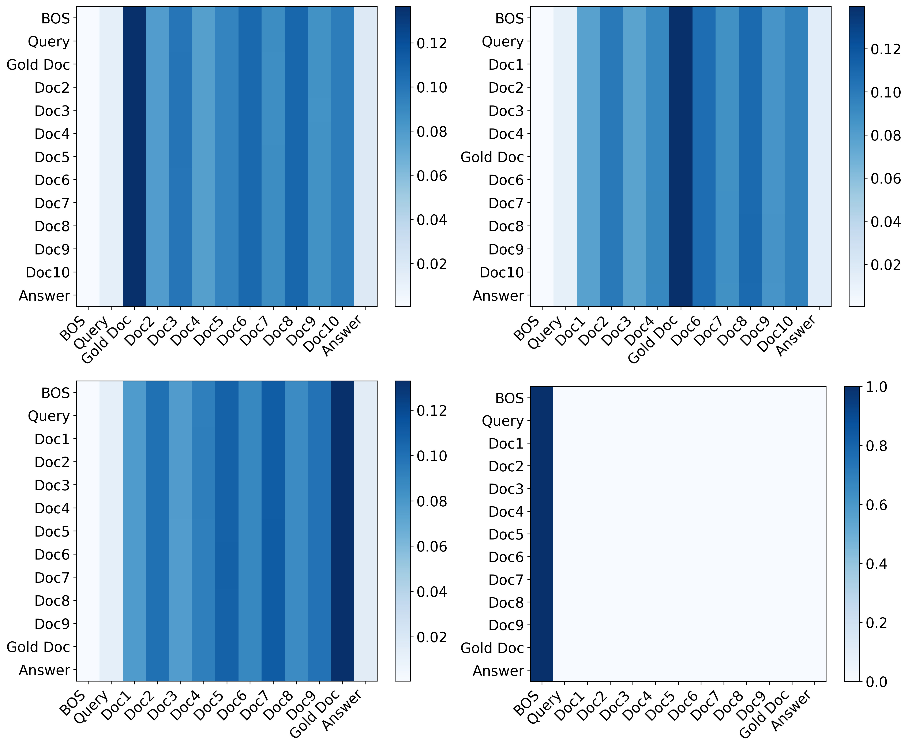

# Revealing the Attention Floating Mechanism in Masked Diffusion Models


Click the links below to view our papers, checkpoints:

<a href='https://arxiv.org/abs/2508.12281'></a><a href='https://huggingface.co/Xubqpanda/LegalDelta'></a>

If you find this work useful, please cite our paper and give us a shining star 🌟
```

```

# 📖 Introduction

**Attention floating** is a mechanistic perspective on how masked diffusion models (MDMs) allocate attention under iterative denoising with bidirectional visibility. Unlike autoregressive models, where attention often collapses into a rigid early-token sink that can bias information flow and exacerbate lost-in-the-middle behavior, MDMs exhibit distributed attention anchors that drift across layers and denoising steps. We further show a Shallow Structure-Aware, Deep Content-Focused pattern: shallow layers rely on structurally salient floating tokens to scaffold global organization, while deeper layers increasingly shift capacity toward semantically informative content, yielding stronger context tracking and large gains on knowledge-intensive tasks.



## 🎉 News

- 20260119: Released our Paper on [arXiv](https://arxiv.org/abs/2508.13021). Released our Code on [GitHub](https://github.com/NEUIR/Attention_Floating). 


# ⚙️ Setup

```bash
conda create --name attention_floating python==3.13
conda activate attention_floating
git clone https://github.com/NEUIR/Attention_Floating.git
cd Attention_Floating
pip install -r requirement.txt
```

# Attention Floating in Masked Diffusion Models (MDMs)

We first conduct comprehensive study on MDMs, including Llada and Dream. We provide (i) analysis/visualization scripts for attention absorption, temporal drift, QK decomposition, retrieval head analysis and region-level attention flow, and (ii) evaluation scripts for knowledge-intensive QA with/without RAG.

## 1) Temporal Drift Visualization (Per-step Floating)
Create temporal heatmaps over denoising steps (MDMs) from step_attention_data:
```bash
python visualization/create_temporal.py \
  --npz /path/to/sample_attentions.npz \
  --output /path/to/out \
  --layer 0 \
  --model /path/to/model
```
<table>
  <tr>
    <td align="center">
      <br/>
      (a) Layer 0.
    </td>
    <td align="center">
      <br/>
      (b) Layer 31.
    </td>
  </tr>
</table>

We observe that:
- **Step-dependent anchors:** attention floating exists and gradually shifts right over denoising steps at each layer.
- **Layer-dependent anchors:** shallow layers show more spread-out attention with multiple active anchors; deep layers become much sparser and concentrate on fewer, sharper anchor positions.
- **Task-dependent anchors:** the floating positions differ across tasks.

## 2) Absorption Rate Comparison across Layers
We quantify how much attention mass is absorbed by sink/floating positions using:

$$
\text{Absorb}(S,\ell)=\sum_{j\in S} A^\ell_j \times 100\%
$$

where $A^\ell_j$ is the head-averaged received attention at position $j$.

```bash
python visualization/absorption_comparison.py
```


ARMs induce a rigid concentration of attention around the sink token `<BOS>`, whereas MDMs display a weaker and more distributed absorption pattern.


## 3) QK Decomposition
To systematically understand *Attention Floating* in MDMs, we start from the **pre-softmax attention scoring mechanism (QK)**. Prior work on **attention sinks** in ARMs shows that the salience of sink positions mainly comes from a systematic advantage in the **directional term** (i.e., $\cos\theta$), while column-wise differences in the **scale term** (i.e., $\|Q\|\|K\|$) are comparatively weaker—often summarized as a form of *key bias*.  
Motivated by this, we decompose the QK dot product as:
$$
QK = \|Q\|\,\|K\| \cos\theta,
$$
where $\theta$ is the angle between $Q$ and $K$.
We can disentangle whether the QK advantage of *floating* key columns in MDMs is driven by **stronger angular alignment, scale amplification, or their combined effect** across depth.
```bash
python visualization/QK_decomposition.py
```


The QK advantage of floating positions evolves from being **combined effect of angular alignment + norm amplification** in shallow layers to a **primarily angle-driven** in deeper layers.

## 4) Retrieval Head Analysis

To verify the **Shallow Structure-Aware, Deep Content-Focused** hypothesis, we further analyze **retrieval-specialized attention heads** following [*Retrieval Head Mechanistically Explains Long-Context Factuality* (Wu et al., 2024)](https://github.com/nightdessert/Retrieval_Head). Concretely, we assign each attention head a retrieval score based on final answer generation.
A higher score means the head more consistently focuses on the key evidence while producing the answer, i.e., it behaves more like a retrieval/evidence-tracking head. We visualize retrieval scores as heatmaps over layers and heads (two figures below):

<table>
  <tr>
    <td align="center">
      <br/>
      (a) Llada.
    </td>
    <td align="center">
      <br/>
      (b) Dream.
    </td>
  </tr>
</table>

## 5) Performance in Learning Knowledge from Contexts
We evaluate ARMs (Llama, Qwen) and MDMs (Dream, Llada) on NQ / TQA / MarcoQA / HotpotQA / T-REx with a unified prompt template. 

```bash
python evaluate/evaluate_*.py
```
Note: the evaluation scripts contain placeholder paths (e.g., dataset_dir, model_path, output_dir). Please edit them before running. 



We observe that MDMs w/ RAG achieve over 19.5\% average improvement compared to their corresponding baseline models, which is more than twice the gain observed for ARMs when augmented with retrieval (ARMs w/ RAG obtain 8.5\% improvements).

## 6) Region-level Attention Flow
We pool token-level attention into coarse regions (BOS / Query / Docs / Answer) and apply rollout:
```bash
python visualization/attention_rollout.py
```



## Contact
If you have questions, suggestions, and bug reports, please email:
```
daix1@mails.neu.edu.cn
```